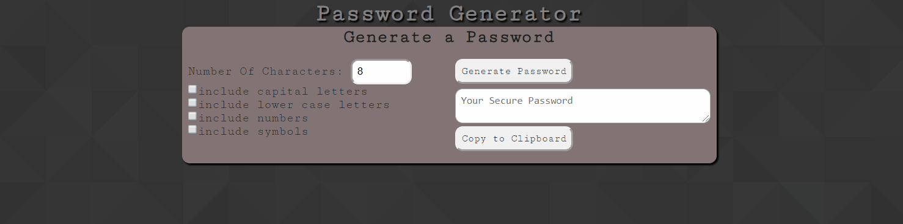

# password-generator
Random password generator 

## Tools Used:
1. HTML/CSS
2. JavaScript/JQuery

## User Story: 
### As a privacy-concerned citizen: 
1. I would like to create a secure password.
2. I would like to be able to select which characters my password will consist of (upper/lower-case letters, numbers, symbols)
3. I would like to be able to choose the length of my password.

## View deployed app [HERE](https://nich-o-las.github.io/password_generator/)
